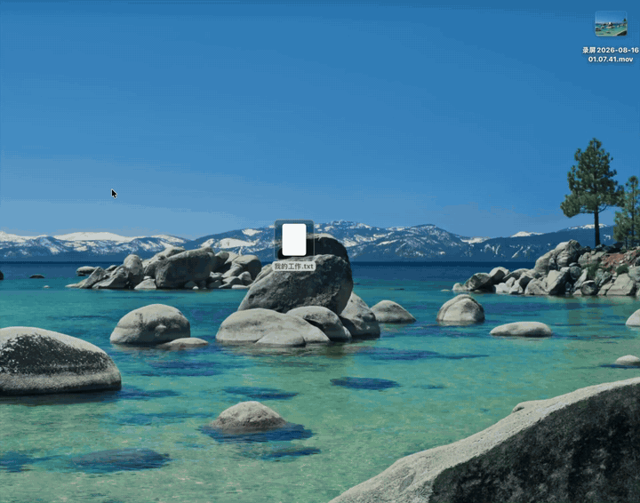
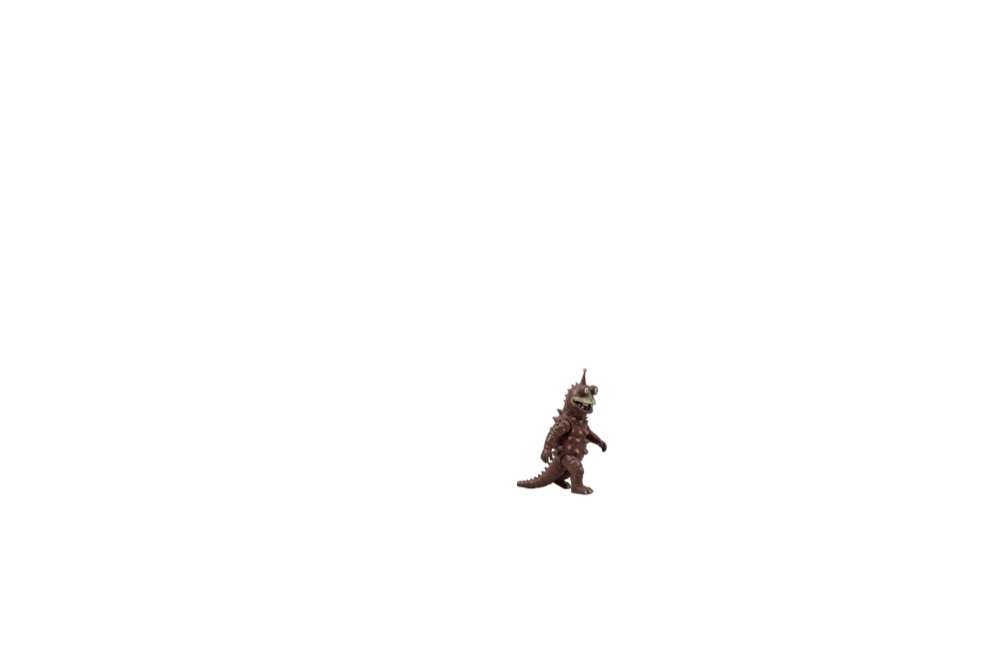
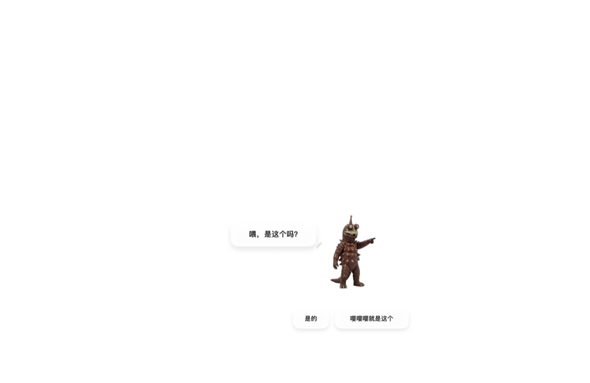
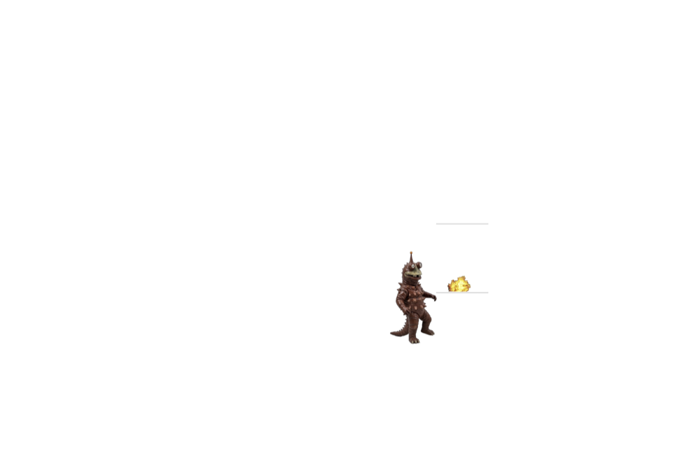
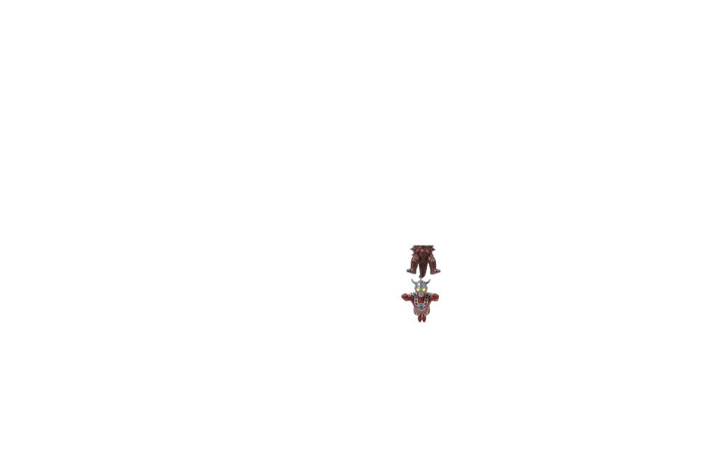

# MonsterDeleter for macOS

> 召唤怪兽大将摧毁文件 —— macOS 移植版

在访达里选中文件，召唤一只怪兽走过来，指着它问「喂，是这个吗？」，然后一脚把它踹进废纸篓。

移植自 Windows 版 [SuperPrintf/MonsterDeleter](https://github.com/SuperPrintf/MonsterDeleter)，动画编排、时序和素材完全一致，界面层用 Swift + AppKit 重写。

> **用 Windows？** 请移步原仓库 👉 **<https://github.com/SuperPrintf/MonsterDeleter>**
> 本仓库只做 macOS 版本。

## 演示



真机录屏：右键召唤 → 准星标记目标 → 怪兽走过来问「是这个吗」→ 一脚踹进废纸篓 → 雷欧登场收工。
[高清版（带声音）](docs/demo.mp4)，也可以在 [Releases](../../releases) 里下载。

<details>
<summary>各阶段单帧</summary>

| 怪兽走来 | 确认 | 踹飞 | 雷欧登场 |
| --- | --- | --- | --- |
|  |  |  |  |

这几张是渲染快照，灰色是桌面的替身，实际运行时是全屏透明覆盖层。

</details>

## 安装

### 1. 下载

到 [Releases](../../releases) 下载 `MonsterDeleter-macOS.zip`，解压得到 `MonsterDeleter.app`，拖进「应用程序」文件夹。

支持 Apple Silicon 和 Intel（通用二进制），需要 macOS 13 或更新版本。

### 2. 首次打开

安装包只做了 ad-hoc 签名，没有付费的 Apple 开发者证书，所以第一次打开会被 Gatekeeper 拦下。两种方式二选一：

- **右键点 App 图标 → 打开**，在弹窗里再点一次「打开」；
- 或者在终端执行一次：

  ```bash
  xattr -dr com.apple.quarantine /Applications/MonsterDeleter.app
  ```

首次打开会弹一个说明窗口，关掉就行——这一步同时让系统把它的服务菜单注册进去。

### 3. 让右键菜单出现

打开「系统设置 → 键盘 → 键盘快捷键 → 服务 → 文件和文件夹」，确认 **「召唤怪兽大将摧毁」** 是勾选状态。

如果菜单迟迟不出现，在终端刷新一下服务缓存：

```bash
/System/Library/CoreServices/pbs -flush
```

## 使用

在访达里选中一个或多个文件、文件夹，然后任选一种方式召唤：

1. **右键 →「服务」→「召唤怪兽大将摧毁」**（推荐）
2. 把文件拖到 `MonsterDeleter.app` 图标上
3. 命令行：`/Applications/MonsterDeleter.app/Contents/MacOS/MonsterDeleter ~/要删的文件.txt`

接下来：

1. 屏幕变成选择界面，鼠标变成红色准星 —— **点一下要摧毁的目标位置**（点哪儿怪兽就在哪儿开打，和文件图标的真实位置无关）；
2. 怪兽走过来，指着目标问「喂，是这个吗？」；
3. 点任意一个回答（两个都是「是」，这是原作的玩笑）；
4. 怪兽一脚踹爆目标，文件进废纸篓，雷欧登场，飞走收工。

**随时按 `esc` 可以中断**，在踹出去之前中断的话文件不会被删。

文件是移进**废纸篓**，不是直接抹掉，误删了可以捞回来。

## 与 Windows 版的差异

| | Windows 版 | 本移植版 |
| --- | --- | --- |
| 右键菜单 | 资源管理器一级菜单（COM 扩展） | 访达「服务」子菜单（NSServices） |
| 删除去向 | 回收站 | 废纸篓 |
| 卸载软件 | 识别快捷方式对应的已安装程序，调官方卸载器 / BCUninstaller | **不做**，macOS 上删 App 就是把 `.app` 扔废纸篓 |
| 权限不足 | 弹 UAC 提权重试 | 直接报哪些文件没删掉 |
| 多显示器 | 鼠标所在显示器 | 同左 |

动画时序（8 fps 精灵、4.5 秒走路、15 帧踹击、爆炸在第 5 帧触发删除……）与 Windows 版逐帧对齐。

## 从源码构建

需要 Xcode 命令行工具。

```bash
git clone https://github.com/Muluk-m/MonsterDeleterMac.git
cd MonsterDeleterMac
./build.sh                # 通用二进制，产物在 build/MonsterDeleter.app
UNIVERSAL=0 ./build.sh    # 只编译本机架构，迭代时快很多
```

自测用的隐藏环境变量：

- `MONSTER_AUTOPLAY=x,y` —— 自动完成两次点击，无人值守跑完整段动画；
- `MONSTER_SNAPSHOT=<目录>` —— 把每个阶段渲染成 PNG 存到该目录；
- `MONSTER_NO_DELETE=1` —— 整段动画照跑，但不真的动文件；
- `MONSTER_NO_AUDIO=1` —— 静音。

## 已知问题

召唤之后到画面开始淡入，中间有约 1.4 秒的空白。这段时间主线程是空闲的（采样确认），窗口也已经在屏幕上，只是定时器还没开始投递；同样的最小 AppKit 程序只要 0.05 秒，所以不是系统固有开销，尚未定位到根因。动画时钟从第一帧真正刷新时才起算，因此淡入是完整播放的，不会跳到中途。

## 致谢与许可

- 原始创意与素材来自 [531149627/MonsterDeleter](https://github.com/531149627/MonsterDeleter)（Python 桌宠版）；
- 本项目直接移植自 [SuperPrintf/MonsterDeleter](https://github.com/SuperPrintf/MonsterDeleter)（Rust + Win32 重写版），动画参数均对照其源码；
- 移植代码以 MIT 许可发布；**图片与音频素材沿用上游项目，版权归原作者及相关权利方所有，仅供学习娱乐使用**。
